## Introduction and Overview

The global telecommunications industry is undergoing a shift towards open, interoperable, and innovation-enabling technologies. One example of this shift is the creation of **Open RAN** (Radio Access Networks), a standard that defines ways in which different vendors' equipment work together seamlessly, to produce a 5G network, breaking the traditional model of relying on a single vendor for all network components. The advancement of Open RAN has coincided with the emergence of **open-source 5G**, which leverages commercial off-the-shelf (COTS) radio hardware combined with open-source software stacks to produce a working base station, 5G core, and network.

Open-source 5G is a disruptive technology that reduces costs, accelerates innovation, and unlocks greater flexibility. It allows smaller operators, researchers, and enterprises to build, customize, and optimize their own 5G networks without the constraints of proprietary technology. The telecommunications industry values open-source 5G because it offers a cost-effective means to experiment, scale, and evolve networks efficiently, fostering rapid innovation without the financial burdens typically associated with proprietary solutions.

By reducing vendor lock-in, open-source 5G is a natural enabler of Open RAN, as both share the goal of flexibility and interoperability. Together, Open RAN and open-source 5G create an environment ripe for innovation, allowing network operators to build efficient, agile systems tailored to their unique needs.

In this guide, we present a step-by-step procedure for building an interference-resilient open-source 5G base station testbed with **srsRAN**, a **USRP X410**, and a **Signalcraft SC2430 Module.** We also provide a "ready-to-go" docker container that includes all gNodeB software components pre-configured to expedite deployment.



### **About srsRAN, USRP, and the SCM**

***[srsRAN](https://www.srslte.com/5g)***, by ***[Software Radio Systems](https://srs.io/)***, is an open-source software suite for building a mobile network (4G or 5G) with commodity computer hardware and COTS Software-Defined Radio (SDR) products. The srsRAN 5G project offers all the components needed to produce a 5G RAN (gNodeB) that is compliant with 3GPP and O-RAN Alliance specifications. Its full L1/2/3 stack is minimally dependent on external factors, ensuring portability across architectures.

The ***[SC2430 NR Signal Conditioning Module](https://www.signalcraft.com/products/test-measurement/microwave-systems/sc2430/)*** (SCM) by ***[SignalCraft Technologies](https://www.signalcraft.com)*** is a front-end solution that offers signal conditioning and amplification for software-defined radio (SDR) systems. Designed specifically for use with the NI Ettus-USRP X410, it ensures that its input and output radio characteristics meet specific 3GPP 5G/NR standards, making it suitable for 5G NR User Equipment (UE) and gNodeB (gNB) implementations. The SCM is able to provide range to the X410 and enable it to operate in congested environments. When coupled with additional amplifier modules, it can achieve distances of up to 1 km, environment permitting.

The ***[USRP X410](https://www.ettus.com/all-products/usrp-x410/)***, by ***[Ettus Research](https://www.ettus.com)***, is a high-performance SDR designed for advanced wireless research and development. Featuring up to 400 MHz of instantaneous bandwidth per channel and support for MIMO configurations, its robust hardware is well-suited for testing and deploying advanced 5G features. Fully compatible with open-source platforms, it offers the flexibility for developers to experiment and optimize network performance in real-world environments, making it a powerful tool for researchers and network operators building open-source 5G networks and pushing the boundaries of 5G innovation.


 <!-- 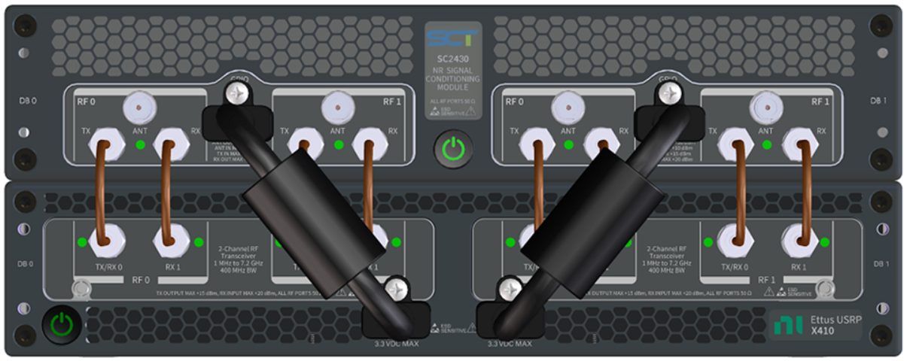 -->

<p align="center">
  
</p>

<!--  -->


These 3 products together can produce a 5G testbed that works with COTS handsets such as consumer cellphones, 5G modems, and 5G add-on modules to devices such as the raspberry pi. It provides a platform for advanced 5G development and is suitable for private 5G network deployments that require enhanced control of the 5G stack's design.

**[Qoherent](https://qoherent.ai)** has a product based on these components, called the [RIA RAN gNodeB](https://qoherent.ai/radiointelligenceapps-ran/), which combines high-performance open-source 5G systems with a deep learning inference engine design for performing radiofrequency signal processing tasks with very low latencies. This special deployment enables the base station to be improved with ML, be used for spectrum monitoring, or to be used for sensing.


## Hardware and Software Prerequisites 

The following prerequisites are required to complete this guide:

 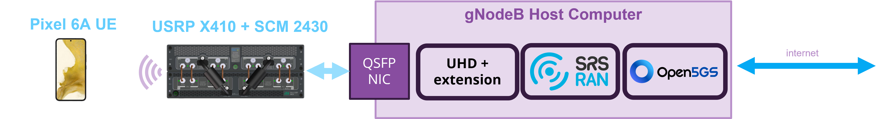

### **Hardware:**

* A reasonably powerful host computer\* (we recommend at least a 10th-generation Intel i7 or 3rd-generation Ryzen 7 with at least 16 GB of RAM).
* A network interface card that supports QSFP\*\* 
* A USRP X410 connected to the host computer\*\*\*
* An SC2430 NR Signal Conditioning Modules
* Appropriate antennae connected to the SCM's Tx and Rx antenna ports
* Appropriate SMA and GPIO cables between the SCM and the USRP
* A Test SIM card and SIM Programmer. We recommend [Open-Cells.com](https://open-cells.com/index.php/sim-cards/).
* A 5G Mobile Phone (we recommend the [Google Pixel 6A](https://en.wikipedia.org/wiki/Pixel_6a)). Other COTS options [here](https://docs.srsran.com/projects/project/en/latest/knowledge_base/source/cots_ues/source/index.html).

### **Software (Installed):**

* [Ubuntu 22.04](https://releases.ubuntu.com/jammy/) on the host computer.
* Optionally the [docker](https://docs.docker.com/get-started/get-docker/) and [docker-compose](https://docs.docker.com/compose/) for seamless installation ==(==[==link below==](https://outlineq.qoherent.ca/doc/setting-up-an-srsran-testbed-with-the-scm2430-and-the-usrp-x410-Y7BFwaTFZ2#h-bonus-docker-images)==)==

### **Software (To be installed during the guide):**

* [Universal Hardware Driver](https://github.com/EttusResearch/uhd) (UHD) for the USRP
* [UHD SCM Driver Extension](https://github.com/SignalCraftTechnologies/SC2430-UHDExtension) to control the configuration of the SCM
* [srsRAN](https://github.com/srsran/srsRAN_Project)
* [Open5GS](https://github.com/open5gs/open5gs) - Open5GS is an [open-source 5G core](https://open5gs.org/) we use in this guide.
* [UICC/SIM](https://open-cells.com/index.php/uiccsim-programing/) SIM Card Programming Software from Open-Cells
* [5G Switch App](https://play.google.com/store/apps/details?id=com.sladjan.sava.petg&hl=en_CA) to enforce 5G mode on the UE

### Other:

* A valid license from the relevant regulatory authority is required for any over-the-air RF transmissions. ***==This guide assumes that you have obtained the necessary license and fulfilled all related requirements.==***
* An internet connection is required for the host machine to complete speed testing and benchmarks.

<div class="fine-print">

*\* The computer impacts gNodeB performance and configuration such as bandwidth it can support. For more details on computer requirements, see **__[this guide](https://docs.srsran.com/projects/4g/en/latest/app_notes/source/hw_packs/source/index.html)__** from SRS*  
*\*\* SFP+ NIC's are compatible with an appropriate adapter. [Please see the Ettus support page.](https://kb.ettus.com/X410#Guidance_on_SFP.2B_Adapters_for_Fiber_Connectivity_on_NI_Ettus_USRP_X410)*  
*\*\*\* Other USRP's such as the B210 or X310 may be used with some extra configuration and timing controls.*

</div>

<style>
  .fine-print p em, .fine-print {
    font-size: 0.75rem; 
    color: #ffffff;
    line-height: 1.15;
    font-style: normal;
    font-weight: bold;
  }
</style>

## Simplified USRP X410 Setup instructions

We present simplified instructions for setting up a USRP by building the UHD from source. To find up-to-date and detailed instructions for building UHD from source, [please see this link](https://files.ettus.com/manual/page_build_guide.html).

#### **Build the default version of UHD:**

Starting from a desired work area on your machine, clone the repo:

```bash
cd ~/workarea/
git clone https://github.com/EttusResearch/uhd.git
```

Step-by-step build instructions:

```bash
cd uhd/host
mkdir build
cd build
cmake ../
make -j4
make test
sudo make install
sudo ldconfig
```

#### **Build a specific version of uhd - e.g.** `4.4.0.0.`**:**

```bash
cd ~/workarea/
git clone https://github.com/EttusResearch/uhd.git
cd uhd/host
mkdir build
cd build
git checkout v4.4.0.0
cmake ../
make -j4
sudo make install
sudo ldconfig
```

For this guide, we specifically recommend v4.4.0.0 although other versions are compatible.

#### **Connecting to the USRP**

Assuming the USRP is connected to the QSFP or SFP+ port it can be found with the `uhd_find_devices` command. Troubleshooting information can be found at the official [Ettus Knowledge Base](https://files.ettus.com/manual/page_usrp_x4xx.html), specifically the [getting started guide](https://files.ettus.com/manual/page_usrp_x4xx.html#x4xx_getting_started).

## How to set up the SCM

### Installing the SCM Extension Drivers from source

The procedure to build the SC2430 Extension is similar to that of the UHD source.

Start by cloning the SCM UHD Extension

```bash
cd ~/workarea/
git clone https://github.com/SignalCraftTechnologies/SC2430-UHDExtension.git
```

To build the extension library source, use CMake to generate Makefiles.

```bash
cd SC2430-UHDExtension
mkdir build && cd build
cmake ../
```

Additional configuration parameters can be provided to CMake. The Extension is built against UHD, therefore, a non-default UHD prefix must be specified as shown below.

```bash
cmake ../ -DCMAKE_INSTALL_PREFIX=<install-path>
```

Next, build and install - The SC2430 extension is installed into the UHD directory *UHD_PREFIX/share/uhd/modules/*. The Extension Library will be loaded automatically at runtime by UHD.

```bash
make
sudo make install
```

For the most part, using the SCM extension should be transparent to the  existing UHD application. On initialization of a `multi_usrp` session,  *extension=sc2430*  must be specified as part of the argument string. Since the X410 is connected directly to the SCM, there is a risk of damage if  the extension argument  is omitted and the X410 TX power is set  too high.

By default, the filter selection of the SCM is determined automatically based on the radio operating frequency. Querying the gain range after setting the desired frequency, will show an increase of the gain range compared to the X410 standalone. The extension manages the gain balance between the SCM and X410 to achieve optimal performance.  There are additional details available on the [Github wiki](https://github.com/SignalCraftTechnologies/SC2430-UHDExtension/wiki#overview "https://github.com/SignalCraftTechnologies/SC2430-UHDExtension/wiki#overview").

## Setting up the Open5GS core

Before deploying and running the srsRAN project, the core network should be deployed first. The core network solution used in this guide is Open5GS, although other 5G core solutions may be used.

Open5GS is an open-source project that provides a fully compliant 5G core network, allowing the deployment of 5G mobile networks using standard protocols. It is widely used by developers and researchers for its flexibility and integration with commercial off-the-shelf hardware, making it ideal for building private and experimental 5G networks.

Open5GS project can be used to configure a private NR/LTE network. It implements 5GC and EPC using the C-language and a WebUI is provided for testing purposes and is implemented in Node.JS and React. Open5GS project can be installed in two ways, either from packages or from source. The following procedure is an installation from source.

### Installing  Open5GS from Source

#### MongoDB

Download and install MongoDB

```bash
sudo apt update
sudo apt install gnupg 
curl -fsSL https://pgp.mongodb.com/server-6.0.asc | sudo gpg -o /usr/share/keyrings/mongodb-server-6.0.gpg --dearmor
```

Create the list file `/etc/apt/sources.list.d/mongodb-org-6.0.list` for your version of Ubuntu. 

```bash
echo "deb [ arch=amd64,arm64 signed-by=/usr/share/keyrings/mongodb-server-6.0.gpg] https://repo.mongodb.org/apt/ubuntu jammy/mongodb-org/6.0 multiverse" | sudo tee /etc/apt/sources.list.d/mongodb-org-6.0.list
```

Install the MongoDB packages.

```bash
sudo apt update
sudo apt install -y mongodb-org
sudo systemctl start mongod (if '/usr/bin/mongod' is not running)
sudo systemctl enable mongod (ensure to automatically start it on system boot)
```

Setting up TUN device (not persistent after rebooting) Create the TUN device with the interface name `ogstun`.

```bash

sudo ip tuntap add name ogstun mode tun
sudo ip addr add 10.45.0.1/16 dev ogstun
sudo ip link set ogstun up
sudo sysctl -w net.ipv4.ip_forward=1

### Add NAT Rule
sudo iptables -t nat -A POSTROUTING -s 10.45.0.0/16 ! -o ogstun -j MASQUERADE
```

#### **Building Open5GS**

Install the dependencies for building the source code.

```bash
sudo apt install python3-pip python3-setuptools python3-wheel ninja-build build-essential flex bison git cmake libsctp-dev libgnutls28-dev libgcrypt-dev libssl-dev libidn11-dev libmongoc-dev libbson-dev libyaml-dev libnghttp2-dev libmicrohttpd-dev libcurl4-gnutls-dev libnghttp2-dev libtins-dev libtalloc-dev meson
```

Clone the source code from the GitHub repo

```bash
cd ~/workarea/
git clone https://github.com/open5gs/open5gs
```

Compile Open5GS with `meson`

```bash
cd open5gs
meson build --prefix=`pwd`/install
ninja -C build
```

Check whether the compilation has successfully completed without error:

```bash
./build/tests/registration/registration
```

\* *Note this test is specific to the 5G Core*

Run the build test test program:

```bash
cd build
meson test -v
```

The build is now ready for installation:

```bash
ninja install
```


#### Configuring the Open5GS Core

To configure Open5GS, a YAML configuration file can be found and edited in the build folder 

```bash
nano configs/sample.yaml
```

To set up the application as a 5G Core:

* set the `NGAP IP` address, `PLMN ID`, `TAC` and `NSSAI`. 


* set the `GTP-U` and `PFCP` IP address.

Settings that require configuration:


1. Access and Mobility Management Function (AMF) Configuration:

```yaml
amf:
    sbi:
      - addr: 127.0.0.5
        port: 7777
    ngap:
      - addr: 127.0.0.5
    metrics:
      addr: 127.0.0.5
      port: 9090
    guami:
      - plmn_id:
          mcc: 001
          mnc: 01
        amf_id:
          region: 2
          set: 1
    tai:
      - plmn_id:
          mcc: 001
          mnc: 01
        tac: 7
    plmn_support:
      - plmn_id:
          mcc: 001
          mnc: 01
        s_nssai:
          - sst: 1
    security:
        integrity_order : [ NIA2, NIA1, NIA0 ]
        ciphering_order : [ NEA0, NEA1, NEA2 ]
    network_name:
        full: Open5GS
    amf_name: open5gs-amf0
```

User Plane Function (UPF) Configuration:

```yaml
upf:
    pfcp:
      - addr: 127.0.0.7
    gtpu:
      - addr: 127.0.0.7
    subnet:
      - addr: 10.45.0.1/16
      - addr: 2001:db8:cafe::1/48
    metrics:
      - addr: 127.0.0.7
        port: 9090
```

#### Running Open5GS

To start the 5G core run the command below:

```bash
./build/tests/app/5gc 
```

By default the application with fetch the config `sample.yaml` file from above: directory: `~/workarea/open5gs/build/configs/sample.yaml`

 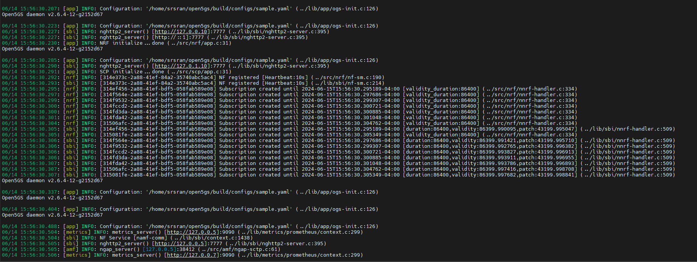

#### Building the web-based user interface for Open5GS

Open5GS is best used with its Web GUI. [Node.js](https://nodejs.org/en) (v18.x or greater) must be installed to build the Web GUI.

```bash
sudo apt install curl
curl -fsSL https://deb.nodesource.com/setup_18.x | sudo -E bash -
sudo apt install nodejs
```

Install the dependencies to run WebUI via `npm`

```bash
cd webui
npm ci
```

The WebUI runs as an [npm](https://www.npmjs.com/) script.

```bash
npm run dev
```


Server listening configuration can be changed by setting the environment variable `HOSTNAME `or `PORT `as below.

```bash
HOSTNAME=192.168.0.11 npm run dev 
PORT=7777 npm run dev
```


#### Register Subscriber Information

Connect to `http://127.0.0.1:9999` and login with the admin account.



Open5GS WebGUI default credentials: 

Username : admin

Password : 1423


Note: You can change the password in ***Account*** Menu. 


To add subscriber information, you can do WebUI operations in the following order: 


1. Go to `Subscriber` Menu. 
2. Click `+` Button to add a new subscriber. Fill the IMSI, security context **(K, OPc, AMF), and APN** of the subscriber. 
3. Click the `SAVE` Button

 

#### Adding UE subscriber info:

The following will need to match the configurations added to the SIM card (see later sections). Specifically, the `IMSI`, `Subscriber key`, and the `Operator Key` need to match the UE.


Examples used in this guide:

* Operator Key (opc)= 63bfa50ee6523365ff14c1f45f88737d
* Subscriber Key (k)    = 00112233445566778899aabbccddeeff
* IMSI (imsi) = 001010123456780


 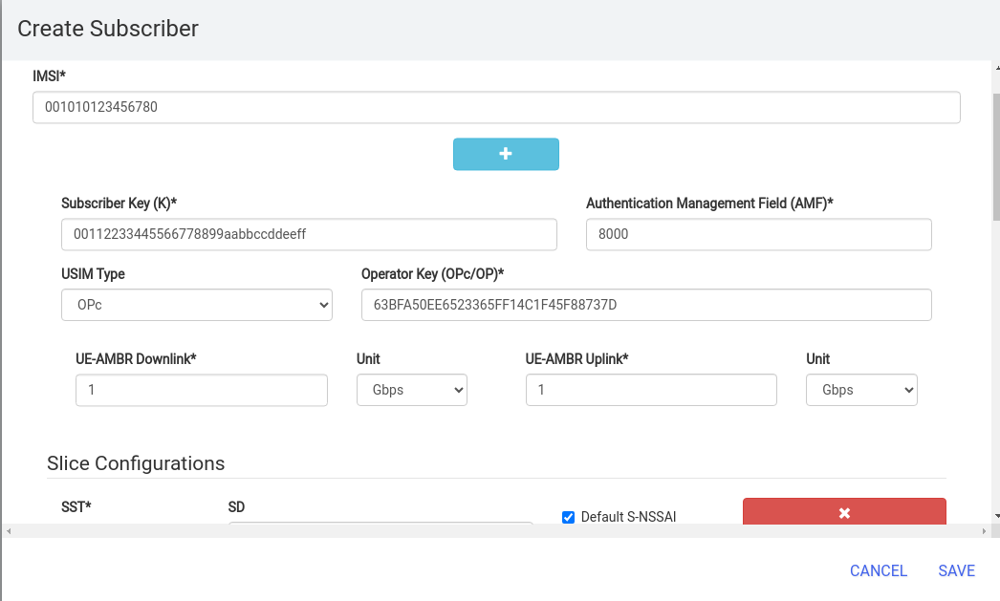

Once the core network is ready, the RAN (gNodeB) May be configured and set up.

## Setting up the gNodeB

The srsRAN Project uses CMake and C++14. We recommend the following build tools:

* [cmake](https://cmake.org/)
* [gcc](https://gcc.gnu.org/) (v9.4.0 or later) **OR** [Clang](https://clang.llvm.org/) (v10.0.0 or later)

The srsRAN Project has the following necessary dependencies:

* [libfftw](https://www.fftw.org/)
* [libsctp](https://github.com/sctp/lksctp-tools)
* [yaml-cpp](https://github.com/jbeder/yaml-cpp)
* [PolarSSL/mbedTLS](https://www.trustedfirmware.org/projects/mbed-tls/)
* [googletest](https://github.com/google/googletest/)

  

```bash
sudo apt-get install cmake make gcc g++ pkg-config libfftw3-dev libmbedtls-dev libsctp-dev libyaml-cpp-dev libgtest-dev
```

#### Code and Build SRS

First, clone the srsRAN Project repository:

```bash
git clone https://github.com/srsRAN/srsRAN_Project.git
```

Then build the code base:

```bash
cd srsRAN_Project
mkdir build
cd build
cmake ../ -DENABLE_EXPORT=ON -DENABLE_ZEROMQ=ON -DAUTO_DETECT_ISA=OFF
make -j $(nproc)
make test -j $(nproc)
sudo make install
```

## Setting up the COTS UE

Important Links for working with a COTS handset:

* SRS Guide on [working with a COTS UE](https://docs.srsran.com/projects/project/en/latest/tutorials/source/cotsUE/source/index.html?highlight=cots%20ue) 
* Overview of the UICC SIM Card: <https://open-cells.com/index.php/uicc-tutorial/>
* Official Steps to program: <https://open-cells.com/index.php/uiccsim-programing/>
* FAQ: <https://open-cells.com/index.php/uicc-faq/>
* Open-Cells Q/A: <https://open-cells.com/index.php/2017/06/08/support-page/>


### **SIM Programming**

The MMC, MNC, IMSI and other credentials in the ISIM can be set by reprogramming. The tool used is open Cells project. The steps are described below.


Download and install the UICC programming application:

```bash
wget https://open-cells.com/d5138782a8739209ec5760865b1e53b0/uicc-v3.2.tgz
tar -xzf uicc-v3.2.tgz
cd uicc-v3.2
make
```

*\* This guide uses v3.2, but v3.3 is available at the time of publication.*


Insert the card in the reader and the reader in a USB socket as:

 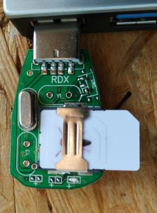
 
 To read the existing basic data on the card:

```bash
sudo ./program_uicc
```


To see the parameters that may be set up with `program_uicc`:

```bash
sudo ./program_uicc --help
```


* `--adm` : This sets the Administrative Code (ADM). It is used for securing operations related to SIM card management and maintenance. The ADM key is required for certain operations like updating encryption keys on the SIM.
* `--imsi` : This sets the International Mobile Subscriber Identity (IMSI). It is a unique number associated with all GSM and Universal Mobile Telecommunications System (UMTS) network mobile phone users. The IMSI is stored as a 64-bit field in the SIM inside the phone and is sent by the phone to the network.
* `--isdn` : This sets the ISDN number (also known as MSISDN), which is the actual phone number assigned to the user.
* `--acc` : This sets the Access Control Class (ACC), which is used to control network access in high-demand situations.
* `--key` : This sets the Ki (Key), which is a 128-bit value used in authenticating the SIMs on the network. It is also used to encrypt calls.
* `--opc` : This sets the OPC (Operator Code), which is derived from Ki and is also used in cryptographic processes.
* `--spn` : This sets the Service Provider Name (SPN), which is a network parameter that can be set on the SIM card.
* `--authenticate`: This is a flag to indicate that authentication should be performed.
* `--noreadafter`: This is likely a flag to indicate that the SIM should not be read after some operation is completed. The exact functionality would depend on the implementation in program_uicc.


To match the core network UE information need to align the opc, k and imsi parameters as below:

* opc  = 63bfa50ee6523365ff14c1f45f88737d
* k    = 00112233445566778899aabbccddeeff
* imsi = 001010123456780

  
  The command to use is:

```bash
sudo ./program_uicc --adm 12345678 --imsi 001010123456780 --isdn 00000001 --acc 0001 --key 00112233445566778899aabbccddeeff --opc 63bfa50ee6523365ff14c1f45f88737d -spn "Open5GS" --authenticate --noreadafter
```


 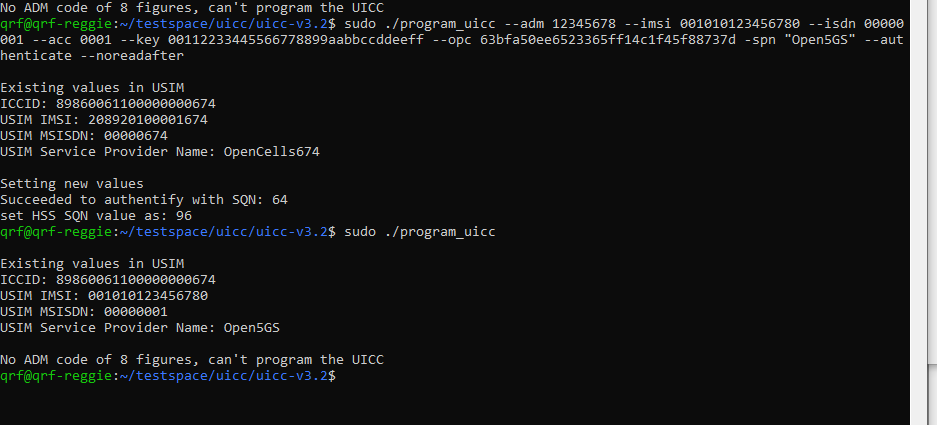

After that, the USIM is inserted into the test UE and the steps below are followed from **Settings** —> **Network and Internet** —> **SIMs** 


Steps to configure


1. Enable ISIM, 5G, and Data Roaming
2. Name the SIM something like "test_sim"
3. Create an APN with settings that match the core network and the gNodeB

   
   1. `MNC` and `MCC` should match the gNodeB (In this case `MNC = 01`, `MCC = 001`) which come from the `PLMN` configuration `MNC:MCC`.
4. Download then enable. the [5G Switch app](https://play.google.com/store/apps/details?id=com.sladjan.sava.petg&hl=en_CA) to force the UE to 5G only


 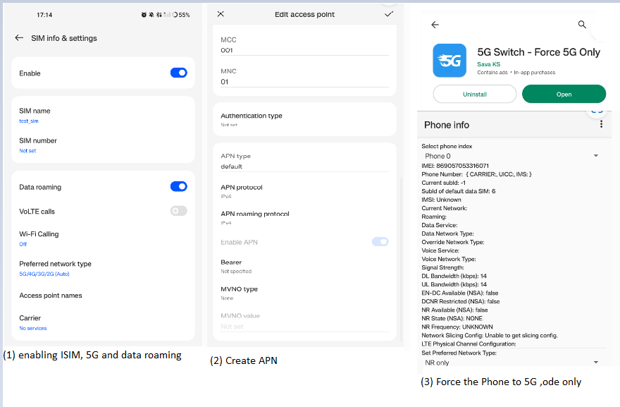

The UE is now ready for testing, the next step is to start up the gNodeB.

## Getting Started with the gNodeB

### **Enabling the SCM Extension**


### Writing and editing a gNodeB config file

Before starting the srsRAN, the YAML configuration file for srsRAN needs to be edited. 

```bash
nano srsRAN_Project/configs/gnb.yaml
```

* Core network information and cell information need to match: `AMF IP address`, `PLMN`, `TAC`
* The SCM Extension also needs to be called via `device_args:  extension=sc2430 `
* Network parameters such as channel bandwidth `channel_bandwidth_MHz` and subcarrier spacing `common_scs` can be configured as well.

```yaml
# This example configuration outlines how to configure the srsRAN Project gNB to create a single FDD cell
# transmitting in band 3, with 20 MHz bandwidth and 15 kHz sub-carrier-spacing. A USRP B200 is configured 
# as the RF frontend using split 8, with a Leo Bodnar GPSDO as an external reference clock. 

# This particular configuration is intended to be used with srsUE. Note the `pdcch` parameters set in the 
# `cell_cfg` section. These are set to match the capabilities of srsUE. 

amf:
  addr: 127.0.0.5                                               # The address or hostname of the AMF.
  bind_addr: 127.0.0.1                                            # A local IP that the gNB binds to for>

ru_sdr:
  device_driver: uhd                                              # The RF driver name.
  device_args:  extension=sc2430                                  # pass the SCM extension
  sync: internal                                                 # Set sync to external. This set-up uses a LEO BODNAR GPDSO providing a 10 MHz ref.
  srate: 11.52
  lo_offset: 0                                                    # RF sample rate might need to be adjusted according to selected bandwidth.
  tx_gain: 15                                                     # Transmit gain of the RF might need to adjusted to the given situation.
  rx_gain: 15                                                     # Receive gain of the RF might need to adjusted to the given situation. 
  #time_alignment_calibration: -300

cell_cfg:
  dl_arfcn: 368500                                                # ARFCN of the downlink carrier (center frequency).
  band: 3                                                         # The NR band.
  channel_bandwidth_MHz: 10                                       # Bandwith in MHz. Number of PRBs will be automatically derived.
  common_scs: 15                                                  # Subcarrier spacing in kHz used for data.
  plmn: "00101"                                                   # PLMN broadcasted by the gNB.
  tac: 7                                                          # Tracking area code (needs to match the core configuration). 
  pdcch:
    dedicated:
      ss2_type: common                                            # Set search space to common to match capabilities
      dci_format_0_1_and_1_1: false                               # Use fallback DCI to match srsUE capabilities

log:
  filename: /tmp/gnb.log                                          # Path of the log file.
  all_level: warning                                                 # Logging level applied to all layers.

pcap:
  mac_enable: enable                                              # Set to true to enable MAC-layer PCAP>
  mac_filename: /tmp/gnb_mac.pcap                                 # Path where the MAC PCAP is stored.
  ngap_enable: enable                                             # Set to true to enable NGAP PCAPs.
  ngap_filename: /tmp/gnb_ngap.pcap                               # Path where the NGAP PCAP is stored.

```

### Starting up the gNodeB

To start the gnb run `gnb` and call the YAML file that was configured:

```bash
 sudo gnb -c srsRAN_Project/configs/gnb.yaml
```


### Example tests for confirming operation


If the connection to the core is successful you should see the following from the AMF log:

```bash
04/03 13:25:13.469: [amf] INFO: gNB-N2 accepted[127.0.0.1]:47633 in ng-path module (../src/amf/ngap-sctp.c:113)
04/03 13:25:13.469: [amf] INFO: gNB-N2 accepted[127.0.0.1] in master_sm module (../src/amf/amf-sm.c:706)
04/03 13:25:13.469: [amf] INFO: [Added] Number of gNBs is now 1 (../src/amf/context.c:1034)
```

The COTS UE can now search for the network. Select the carrier for the network based on the network name you gave, the UE should then attach to the network. 

 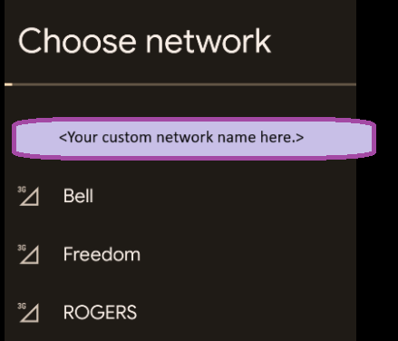

The UE will show "5G" in the upper right corner:

 <!-- 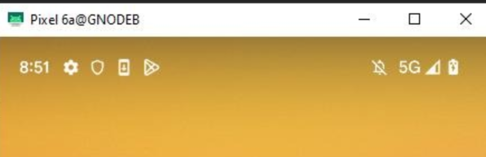 -->


To confirm that the attachment operation is successful both the AMF log and gNB console output can be monitored. The AMF log should look similar to the following:

```bash
04/27 13:16:31.746: [amf] INFO: InitialUEMessage (../src/amf/ngap-handler.c:361)
04/27 13:16:31.746: [amf] INFO: [Added] Number of gNB-UEs is now 1 (../src/amf/context.c:2036)
04/27 13:16:31.746: [amf] INFO:     RAN_UE_NGAP_ID[0] AMF_UE_NGAP_ID[78] TAC[7] CellID[0x0] (../src/amf/ngap-handler.c:497)
04/27 13:16:31.746: [amf] INFO: [suci-0-001-01-0-0-0-0000068960] Known UE by 5G-S_TMSI[AMF_ID:0x20040,M_TMSI:0xdd00ff1a] (../src/amf/context.c:1402)
04/27 13:16:31.746: [gmm] INFO: Registration request (../src/amf/gmm-sm.c:134)
04/27 13:16:31.746: [gmm] INFO: [suci-0-001-01-0-0-0-0000068960]    5G-S_GUTI[AMF_ID:0x20040,M_TMSI:0xdd00ff1a] (../src/amf/gmm-handler.c:169)
04/27 13:16:31.913: [gmm] INFO: [imsi-001010000068960] Registration complete (../src/amf/gmm-sm.c:1063)
04/27 13:16:31.913: [amf] INFO: [imsi-001010000068960] Configuration update command (../src/amf/nas-path.c:389)
04/27 13:16:31.913: [gmm] INFO:     UTC [2023-04-27T13:16:31] Timezone[0]/DST[0] (../src/amf/gmm-build.c:502)
04/27 13:16:31.913: [gmm] INFO:     LOCAL [2023-04-27T13:16:31] Timezone[0]/DST[0] (../src/amf/gmm-build.c:507)
04/27 13:16:32.105: [gmm] INFO: UE SUPI[imsi-001010000068960] DNN[srsapn] S_NSSAI[SST:1 SD:0xffffff] (../src/amf/gmm-handler.c:1042)
```


The gNB trace should show the following:

```bash
          -------------DL----------------|------------------UL--------------------
pci rnti  cqi  mcs  brate   ok  nok  (%) | pusch  mcs  brate   ok  nok  (%)    bsr
  1 4601   15   15   4.3k    7    0   0% |  21.3   23    17k    4    0   0%    0.0
  1 4601   15   27   287k   84    0   0% |  23.1   27   233k   39    0   0%    0.0
  1 4601   15   28   1.2k    1    0   0% |  21.8   28   8.7k    2    0   0%    0.0
  1 4601   15    0      0    0    0   0% |   n/a    0      0    0    0   0%    0.0
  1 4601   15    0      0    0    0   0% |   n/a    0      0    0    0   0%    0.0
  1 4601   15    0      0    0    0   0% |   n/a    0      0    0    0   0%    0.0
  1 4601   12    0      0    0    0   0% |   n/a    0      0    0    0   0%    0.0
  1 4601   15    0      0    0    0   0% |   n/a    0      0    0    0   0%    0.0
  1 4601   15   28    53k   10    0   0% |  24.6   26    55k   32    0   0%    0.0
  1 4601   15   28   7.7k    4    0   0% |  22.7   28    17k    4    0   0%    0.0
  1 4601   15    0      0    0    0   0% |   n/a    0      0    0    0   0%    0.0
```

The first test we suggest is a **ping test** to the core's IP address or to a website on the internet (ensure that WIFI is disabled on the UE)

 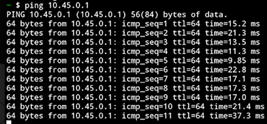


**Speed tests** can be run from the UE to verify connection statistics:

 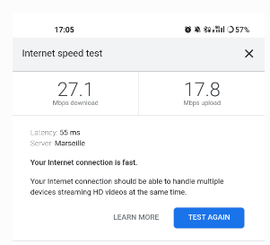

 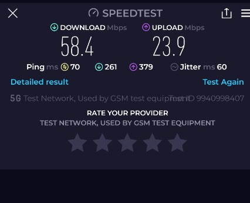


We also recommend **streaming tests** such as playing a YouTube video, sharing the screen of the UE via a YouTube video in an app such as Google Meet, or streaming the camera from Google Meet:

 

You will also be able to **ambiently observe** the signals with another SDR or a spectrum analyzer:

 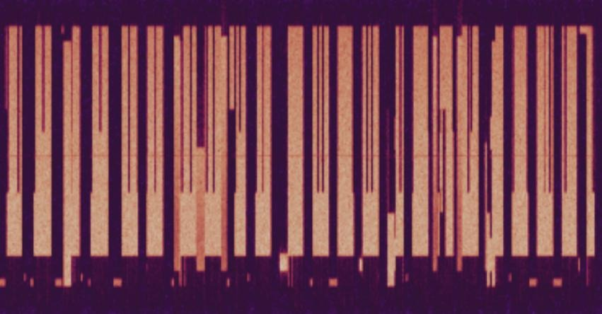

## RAN Metrics

srsRAN comes with a suite of metrics available via a Grafana interface. {what the metrics demo}. To enable the metrics, two steps are required:


1. Deploy the Grafana and metrics servers using the docker images through docker-compose (v2 or later). To launch the docker image for the Grafana UI, run the following command from the main folder containing srsRAN:

```bash
sudo docker compose -f docker/docker-compose.yml up grafana
```


2. Modify the gNodeB YAML configuration file to indicate the metrics server IP address and port:

```yaml
metrics:  
    enable_json_metrics: true       # Enable reporting metrics in JSON format
    addr: 172.19.1.4                # Metrics-server IP
    port: 55555                     # Metrics-server Port
```


The metrics will now be available at the specified IP address and port in your web browser:

 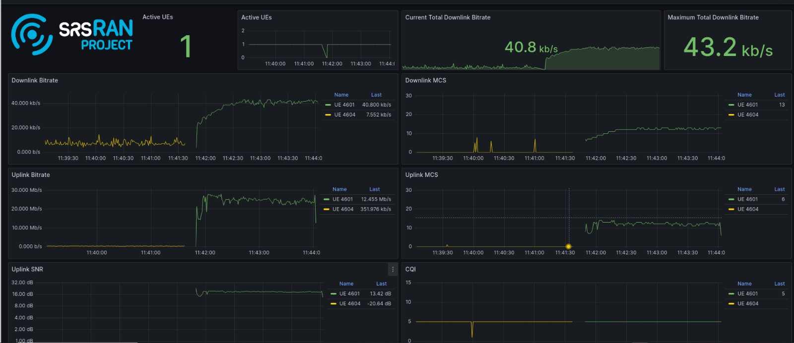

## Bonus - Docker images

The previous procedure was a step-by-step installation of  all the software required to deploy and run the testbed on a host computer. To simplify this procedure, Qoherent provides a docker image that contains all the necessary components. Docker offers a more direct and portable way of installing and running the software. An image containing all the required software—UHD, SC2430, Open5gs, srsRAN, send_0-mq.py—is offered on docker hub at: **https://hub.docker.com/r/qoherent/srsran_scm**

 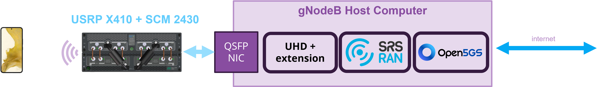

**To get started:**

Create volumes for data persistency: 

```bash
sudo docker volume create mongodb_data # Volume for database
sudo docker volume create configs  # Volume for the open5gs configs
sudo docker volume create config  # Volume for the gnb config
```


Download the docker image and run the docker container

```bash
sudo docker run -it --privileged --network=host -v configs:/etc/open5gs/ -v mongodb_data:/var/lib/mongodb -v config:/srsRAN_Project/configs qoherent/srsran_scm
```


Update the amf.yaml and upf.yaml configuration files in the  container 

```bash
nano /etc/open5gs/amf.yaml
nano /etc/open5gs/umf.yaml
```


Open another terminal and from the host run the userplane configuration, IP Masquerading and route to the internet commands

```bash
sudo ip tuntap add name ogstun mode tun
sudo ip addr add 10.45.0.1/16 dev ogstun
sudo ip link set ogstun up
sudo sysctl -w net.ipv4.ip_forward=1

### Add NAT Rule
sudo iptables -t nat -A POSTROUTING -s 10.45.0.0/16 ! -o ogstun -j MASQUERADE
sudo ufw disable
```


Switch back to the docker terminal and start the core services by starting the database and running the setup scripts

```bash
systemctl start mongod
./etc/open5gs/setup.sh
```


Configure the UE info in the core network as shown earlier: Open a browser and connect to the address [http://127.0.1.1:9999/](http://127.0.1.1:3000/)



Qoherent srsRAN-SCM docker default credentials: 

Username : admin

Password : 1423




Edit the gnb config file and run the start.sh script that will spawn 2 tmux sessions one for the gnb, another for the IQ samples publishing to ZMQ

```bash
nano /srsRAN_Project/configs/gnb_ota.yaml
./start.sh
tmux ls
```


To test, try to attach the UE and browse the internet as shown earlier. Accessing the metrics server is also possible in this setup.


## Conclusion

In this article, we presented a step-by-step guide for setting up a USRP X410, SC2430, and srsRAN together to create an ORAN-native and split 7-compliant 5G testbed capable of transmission over practical distances in congested RF environments. To simplify the setup, we also offer a "ready to deploy" docker container with all components pre-configured.

This configuration can be used as a platform for research, for 5G application development, directly as an operating network, and with the help of Qoherent's RIA RAN product, AI can be integrated for advanced signal processing tasks such as spectrum monitoring, spectrum sharing, or sensing.

For any questions about srsRAN, the X410, the SC2430, or for help setting up your testbed or network, please contact Qoherent at hello@qoherent.ai.

## **About Us:**

### **Qoherent**

Qoherent is an early-stage technology company that specializes in AI development for software-defined radios (SDRs), focusing on streamlining the workflow for radio signal processing engineers and researchers in wireless technologies with software and IP products.

Qoherent helps scientists and engineers explore applications of AI on software-defined radios. We strive to propel intelligent radio innovations through rapid prototyping and design automation tools that are tightly integrated with existing commercial technologies. Focused on the complex spectrum conditions inherent to the space, telecommunications, and defence sectors, we empower our customers to create AI-enabled solutions for more effective sensing and communications systems.

### **SignalCraft Technologies**

SignalCraft, based in Calgary, Alberta, builds brilliantly designed high-frequency digital and RF products, 100 per cent in-house, from the ground up, to spec and on schedule. SignalCraft is the trusted partner of wireless product teams, from leading global test brands to industrial communications startups. SignalCraft is an authorized reseller of Ettus Research USRP equipment.

### **Software Radio Systems**

Software Radio Systems, based in Ireland, is the leading provider of deployable and open RAN software for mobile wireless applications. The srsRAN full-stack software solution is portable across hardware platforms, modular and highly scalable. Developed in-house by the SRS team, srsRAN is available under open-source and commercial licenses.