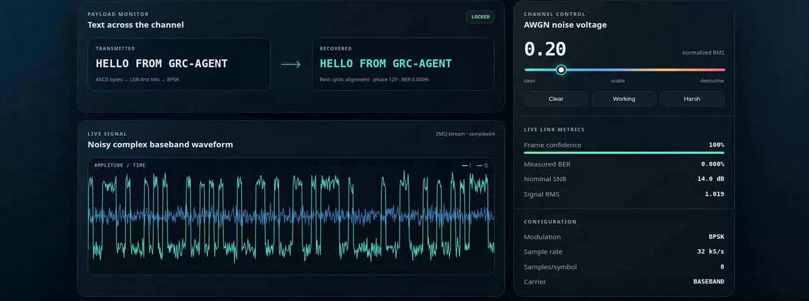

[GRC-Agent](/gnu-radio-agent/) is a free, open-source AI assistant built directly into GNU Radio Companion. There is no external web server, no detached browser tab, no subprocess bridge, and no copying code between windows.

The whole thing is one native GTK3 process. GRC's canvas and the chat sidebar share a single event loop, and the agent edits the *same live flowgraph object* the canvas is drawing. Nothing is round-tripped through a file.



## Why not a general coding assistant

General-purpose coding assistants treat a flowgraph as a text file. That sounds reasonable until you look at what a `.grc` file actually is.

It is YAML, and most of it is canvas bookkeeping: block coordinates, rotations, port bus structures, GUI hints. A dial tone example, about the simplest flowgraph there is, runs to more than five hundred lines. A model editing that as text has a great deal to get right, and the failure modes are quiet ones. It invents block IDs that do not exist. It passes Hertz to a block that expects radians per sample. It leaves blocks overlapping and ports mismatched. The graph looks plausible and does not work.

GRC-Agent operates inside the GRC runtime instead.

### It edits the graph, not the file

The agent and the canvas are the same process, sharing the active flowgraph in memory. Edits redraw instantly. There are no reload prompts, and GRC's own undo and redo keep working, so an edit the agent made and an edit you made by hand sit in the same history.

Topology changes re-arrange the whole graph into a clean layered layout, each independent chain in its own row. The canvas does not degrade into a pile of blocks after a few multi-step edits.

### It asks before it changes anything

This is the default. Every edit shows you the agent's one-line reason and a structured summary of the proposed change, and you approve, deny, or choose to always accept. A Mode toggle switches to Auto when you would rather it stopped asking, and back whenever you like.

Running a flowgraph always asks, because it may transmit on connected hardware. Stopping never does. Ask for a bounded run and the agent stops the graph itself when the time is up, so nothing leaks into the background.

There is also a separate read-only Planner mode that researches and drafts a step-by-step plan without touching anything. Nothing changes until you hand the plan to the executor.

### It looks things up instead of remembering them

Block IDs, port names, parameter keys and concepts come from a searchable GNU Radio catalog and documentation wiki, with web search as a fallback for anything not covered.

This matters more than it sounds. Several GNU Radio blocks take frequency parameters in radians per sample rather than Hertz, and the documentation says so in capitals precisely because it catches people so often. Pass Hertz and the flowgraph validates, compiles, runs, and produces nonsense with no error at all. A model answering from memory gets this wrong because the unit is not in the block name or the parameter name. It is in the docstring. Retrieval fixes it; a larger model does not.

Keyword search over the catalog works out of the box with no extra downloads. A local semantic search backend is an optional one-click install, about 345 MB, which fuses vector similarity with keyword ranking for better retrieval.

### It cannot leave your graph half-edited

Every change is applied as a single batch and then handed to GNU Radio's own validator. If validation fails, the entire batch rolls back and the graph is left exactly as it was. The agent receives the validator's actual error text and tries again.

That is the sentence worth remembering. The agent cannot break your flowgraph, because GNU Radio itself is the thing deciding whether an edit is allowed to land.

### It reads its own failures

When a run fails the agent gets the return code, reads the full console log itself, and proposes a fix. With the run tools above, the probe, run, and read-the-log verification loop happens in a single turn rather than across a conversation.

## What it looks like in practice

Asked for a live ADS-B aircraft tracker from a PlutoSDR, receive-only and with no firmware changes, it built the full receive and decode chain plus a browser dashboard, and tracked real aircraft overhead.


The first build did not decode. Told so, it re-examined its own CRC and pulse-decoding logic, corrected the chain, and started counting valid frames.

Asked for a simulated BPSK link through a noisy channel, it built the flowgraph and a dashboard showing the transmitted and recovered message, a live bit error rate, and an adjustable noise slider.



## Beyond the graph

The agent also works with the rest of your project, inside a directory you designate.

It reads project files, Python through to CMake and YAML, and writes source and config files with atomic saves and conflict detection. Flowgraphs are deliberately read-only to those tools: a `.grc` is only ever edited through the validated graph tools, never by writing the file.

It runs approved shell commands in your project folder, build toolchains and SDR utilities among them, showing you the full literal command on an approval card first. Destructive commands are denied outright. Your provider API keys are stripped from the environment of anything it spawns. Every tool result that comes from a file or the web is scanned for prompt injection, and every detection is logged and disclosed rather than silently dropped.

## Bring your own model

A dozen providers are supported, switchable from Settings with the model and key applying immediately and no restart. Local or LAN Ollama, Ollama Cloud, OpenRouter, OpenAI, Anthropic, Google, Groq, Mistral, Cohere, xAI, any OpenAI-compatible endpoint such as llama.cpp or vLLM, and ChatGPT Plus or Pro through a browser sign-in with no API key at all.

Run a local model and your flowgraph, your prompts and the replies stay on your machine. Worth being precise about the exception: the agent includes web search and page fetch tools and will reach the internet when it uses either.

## Getting started

You need GNU Radio 3.10 with Python bindings, Python 3.12 to 3.14, and [uv](https://docs.astral.sh/uv/). CI covers Ubuntu 24.04 and 26.04.

```bash
sudo apt install gnuradio python3-gi python3-gi-cairo

git clone https://github.com/qoherent/GRC-Agent.git
cd GRC-Agent
uv venv --system-site-packages --python /usr/bin/python3
uv sync --extra dev --locked --python .venv/bin/python

uv run grc-agent
```

Use `/usr/bin/python3` explicitly. GNU Radio's bindings are compiled against your system interpreter, so a uv-managed, pyenv or conda Python will fail to import `gnuradio` even with the bridge.

Ubuntu 22.04 will not work, since it ships Python 3.10 and there is no way to bridge that to the 3.12 the agent requires without rebuilding GNU Radio.

If you are using a local Ollama model, raise the context window first. The default is too small for multi-turn tool calling: set `OLLAMA_CONTEXT_LENGTH=120000` and restart the daemon.

A native window opens with GRC's canvas on the left and the chat sidebar on the right. Open a `.grc` from GRC's File menu and the agent follows the active tab.

## Open source

GRC-Agent is released under AGPLv3, although alternative permissive and commercial licensing options are available on request. Using it to design flowgraphs places no obligation on you and does not make your designs open source.

Source, issues and documentation: [github.com/qoherent/GRC-Agent](https://github.com/qoherent/GRC-Agent)

More about the project, including answers to the questions we get asked most, on the [GRC-Agent product page](/gnu-radio-agent/).
