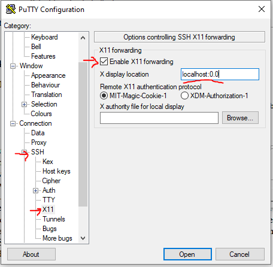

## How to install Scrcpy to mirror Android phone

**Scrcpy**, referred to as “**Screen Copy**” is an open-source software enabling a PC  to remote control an Android phone that is either connected through USB or through WIFI.

Scrcpy is a great way to remotely control an UE as part of a 5G or OpenRAN development activity. Qoherent uses Scrcpy to control our UE’s remotely, as part of collaborations with partner companies in other cities, and to enable our team to work remotely and independently.

Scrcpy supports Linux, Windows, and MacOS. The following guide is for controlling the phone from a remote ubuntu-based system, with remote connection from a local Windows machine.

### Installation procedure (Ubuntu remote target)

SSH into your remote machine (or open a terminal) and install with the following commands:

```bash
# for Debian/Ubuntu
sudo apt install ffmpeg libsdl2-2.0-0 adb wget \
                 gcc git pkg-config meson ninja-build libsdl2-dev \
                 libavcodec-dev libavdevice-dev libavformat-dev libavutil-dev \
                 libswresample-dev libusb-1.0-0 libusb-1.0-0-dev

git clone https://github.com/Genymobile/scrcpy
cd scrcpy
./install_release.sh         
```


### Set up USB Debugging to enable the remote machine to control the phone 

Put the Android phone in developer mode and enable USB debugging:

* On the phone, go to **Settings** → **About phone** → **Software information** → **Select Build numbe**r (click 7 times) → **Developer Mode** will come up.
* Return to settings, **Developer options** will appear, select it and then enable **USB debugging**
* Connect the phone to a USB port of the Linux PC where Scrcpy is installed. A popup appears on the phone screen, then, authorize the USB debugging connection to this PC.


### Install an X-server

1) Install VcXsrv from <https://sourceforge.net/projects/vcxsrv/>

2) Run VcXsrv with “multiple windows“ (first page) and “start no client“ (second page)


Go with default settings for the remainder of the screens.


### Enable X11 forwarding in a terminal session

The simplest method is to use PuTTY which enables all the right settings within the gui.


In PuTTY set up the correct address / keys / ports


Then enable X11 forwarding on the SSH Pane and set **X display location** to `localhost:0.0`



Click “open“ then log in.


### Running scrcpy

*  Start the application using the below command:

```bash
scrcpy
```


if there is an audio error, add the `--no-audio` flag

```bash
scrcpy --no-audio
```


If the USB connection is enabled and the phone is detected,  a GUI interface mirroring the phone screen will appear. You are now ready to control your UE remotely!


 


